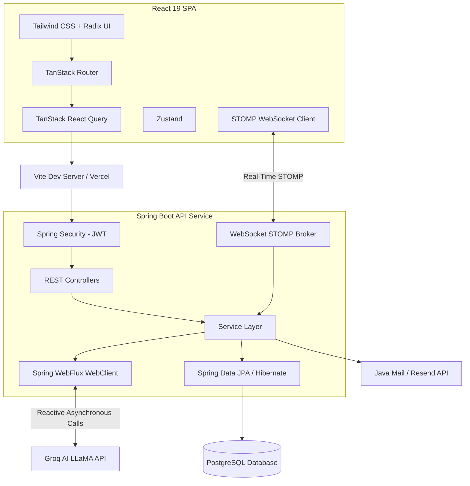

# Alaya Master Coach ✨
> **An AI-Driven and Human-Guided Accountability Coaching SaaS Platform**

[](https://www.oracle.com/java/)
[](https://spring.io/projects/spring-boot)
[](https://react.dev/)
[](https://www.typescriptlang.org/)
[](https://www.postgresql.org/)
[](https://groq.com/)
[](https://tailwindcss.com/)

---

## 📖 Table of Contents
1. [Overview](#-overview)
2. [Key Features](#-key-features)
3. [System Architecture](#-system-architecture)
4. [Database Schema](#-database-schema)
5. [Tech Stack](#-tech-stack)
6. [Prerequisites](#-prerequisites)
7. [Installation & Setup](#-installation--setup)
8. [Environment Variables Reference](#-environment-variables-reference)
9. [Project Structure](#-project-structure)

---

## 🌟 Overview
**Alaya Master Coach** is a full-stack, enterprise-ready accountability coaching SaaS. In behavioral science, accountability is the single most critical factor in habit sticking. Alaya bridges the gap by implementing a **hybrid coaching loop**:
1. **Automated AI Intelligence**: Leverages state-of-the-art Large Language Models (Groq LLaMA 3.3) and Vision Models to analyze daily check-ins, assess meal tracking logs, and generate immediate behavioral suggestions.
2. **Direct Human Coach Interaction**: Bridges users to physical coaches via a low-latency real-time chat interface, enabling direct, high-value intervention.

---

## 🚀 Key Features

### 1. 🤖 AI Coaching Engine (Groq LLM)
* **Immediate Check-in Analysis**: On daily check-ins, a background process formats system prompts, evaluates goal progress, and calls the Groq LLaMA API for instant coaching advice.
* **Weekly Summary Reports**: Collects weekly habit data and generates high-level progress indicators, trends, and targeted guidance.

### 2. 📸 Computer Vision Meal Logging (Groq Vision)
* **Automated Calorie Assessment**: Users upload food photographs; the backend passes the base64-encoded image to Groq's vision API, which identifies ingredients, estimates calories, assesses health status (HEALTHY/UNHEALTHY), and suggests follow-up questions.
* **Diet Tracking**: Integrates meal logs directly into user target statistics.

### 3. 💬 Real-Time Chat (WebSocket Protocol)
* **Bidirectional Messaging**: Uses WebSockets with STOMP protocol and SockJS to establish a message stream between clients and their designated coach.
* **Persistent History**: Stores conversation logs securely in PostgreSQL.

### 4. 📊 Analytics Dashboard
* **Dynamic Progress Visualizations**: Rendered using Recharts, showing daily calorie targets, completed goals, habit frequencies, and weekly weight trends.
* **Onboarding Customization**: Tracks personal statistics (Height, Target Weight, Birth Date, Activity Levels) to customize recommendations.

### 5. 🔒 Secure Onboarding & Security
* **JWT Authorization**: Implements stateless JSON Web Token security for API routes.
* **OTP Email Verification**: Sends one-time registration codes and password-reset links using Java Mail and Resend API integrations.

---

## 🏗️ System Architecture



---

## 🗄️ Database Schema
The SQL database is powered by **PostgreSQL**. The Spring Data JPA mapping generates the following core relationships:

* **User**: Base model representing Clients and Coaches. Holds profile variables (height, current/target weights, daily calorie goals, primary goal, activity levels).
* **Goal**: Tracked tasks linked to users (Many-to-One), including target deadlines and completion timestamps.
* **Checkin**: Logs daily status, client notes, and AI-generated progress feedback.
* **FoodEntry**: Tracks diet logs, including meal names, image URLs, calories, health classification, and vision-generated feedback.
* **ChatMessage**: Maintains low-latency messages between coaches and clients.
* **OtpToken**: Implements authentication OTP keys mapped to user email targets.

---

## 🛠️ Tech Stack

### Frontend Portal
* **Framework**: React 19 (TypeScript)
* **Build Tool**: Vite 7
* **Router**: TanStack Router (Typesafe Routing)
* **State Management**: TanStack React Query & Zustand
* **Styling**: Tailwind CSS (v4) & Radix UI Primitives
* **Visualizations & Animations**: Recharts & Framer Motion
* **WebSocket client**: `@stomp/stompjs` & `sockjs-client`

### Backend Services
* **Language & Runtime**: Java 17 & Spring Boot 3.2.5
* **Build Automation**: Maven
* **Database Access**: Spring Data JPA & Hibernate ORM
* **Security & Auth**: Spring Security & JWT (`io.jsonwebtoken`)
* **Asynchronous Integration**: Spring WebFlux `WebClient` (for non-blocking AI calls)
* **Real-time Engine**: Spring WebSocket Messaging Protocol
* **Mailing Service**: Spring Boot Mail Sender & Resend API integration

---

## 📋 Prerequisites
Ensure you have the following installed on your machine:
* **Java Development Kit (JDK)**: version 17 or higher
* **Node.js**: version 18.x or higher (or **Bun**)
* **PostgreSQL Database**: version 14 or higher

---

## ⚙️ Installation & Setup

### Step 1: Clone the Repository
```bash
git clone https://github.com/Ashenchamuditha/AlayaCoach.git
cd AlayaCoach
```

### Step 2: PostgreSQL Database Setup
1. Create a local PostgreSQL database named `AlayaCoach`.
2. The schema files and data updates will automatically run on startup via Hibernate (`ddl-auto=update`) and `schema.sql`.

### Step 3: Backend Setup & Run
1. Navigate to the `backend` directory:
   ```bash
   cd backend
   ```
2. Create an environment file or export variables (see [Environment Variables Reference](#-environment-variables-reference)).
3. Build and launch the Spring Boot server:
   ```bash
   ./mvnw spring-boot:run
   ```
   *The backend will boot up and bind to port `8081` by default.*

### Step 4: Frontend Setup & Run
1. Open a new terminal and navigate to the `frontend` directory:
   ```bash
   cd ../frontend
   ```
2. Copy the example environment template:
   ```bash
   cp .env.example .env
   ```
3. Install the dependencies:
   ```bash
   npm install
   # OR if using Bun:
   bun install
   ```
4. Start the frontend Vite development server:
   ```bash
   npm run dev
   ```
   *The frontend will run at `http://localhost:8080/`.*

---

## 🔑 Environment Variables Reference

### Backend (`backend/src/main/resources/application.properties`)
You can override default properties using local environment configurations:

| Property | Default Value / Template | Description |
| :--- | :--- | :--- |
| `spring.datasource.url` | `jdbc:postgresql://localhost:5432/AlayaCoach` | Database URL |
| `spring.datasource.username`| `postgres` | PostgreSQL Username |
| `spring.datasource.password`| `root` | PostgreSQL Password |
| `JWT_SECRET` | *(64-character Hex Encoded Key)* | Key for signing JWTs |
| `groq.api.key` | `gsk_...` | Groq API access token |
| `RESEND_API_KEY` | `re_...` | Resend API token (for email services) |
| `spring.mail.host` | `smtp.gmail.com` | Backup SMTP Host |
| `spring.mail.username` | `your-email@gmail.com` | SMTP Username |
| `spring.mail.password` | `your-app-password` | SMTP App Password |

### Frontend (`frontend/.env`)
| Variable | Default Value | Description |
| :--- | :--- | :--- |
| `VITE_API_URL` | `http://localhost:8081/api` | Host URL for backend endpoints |

---

## 📂 Project Structure
```text
AlayaCoach/
├── backend/
│   ├── src/main/java/com/alaya/
│   │   ├── config/          # Configurations (JWT, CORS, WebSockets)
│   │   ├── controller/      # REST Endpoints
│   │   ├── dto/             # Data Transfer Objects
│   │   ├── model/           # Database JPA Entities
│   │   ├── repository/      # Spring Data Repositories
│   │   └── service/         # Core business and AI integrations
│   ├── src/main/resources/
│   │   ├── application.properties
│   │   └── schema.sql
│   └── pom.xml              # Maven dependencies
│
└── frontend/
    ├── src/
    │   ├── components/      # Reusable UI Elements (Radix / custom UI)
    │   ├── hooks/           # Custom React hooks
    │   ├── lib/             # API client services
    │   ├── routes/          # TanStack Router components
    │   ├── store/           # Zustand client state
    │   └── styles.css       # Core Tailwind CSS file
    ├── package.json         # Frontend dependencies
    └── vite.config.ts       # Vite config
```
